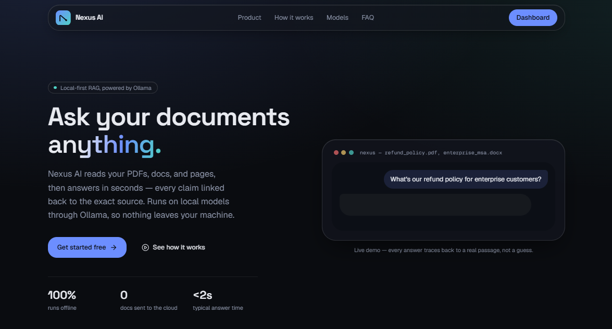
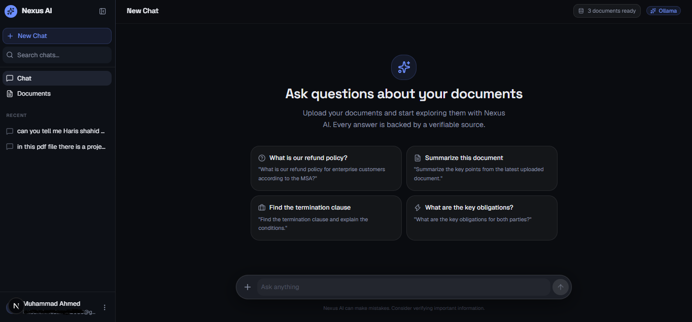
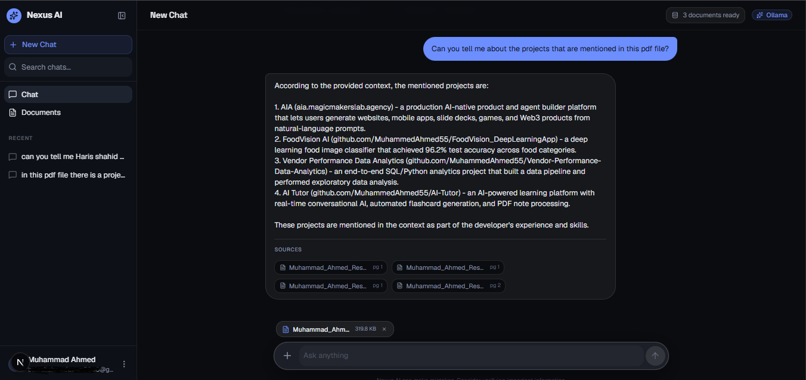
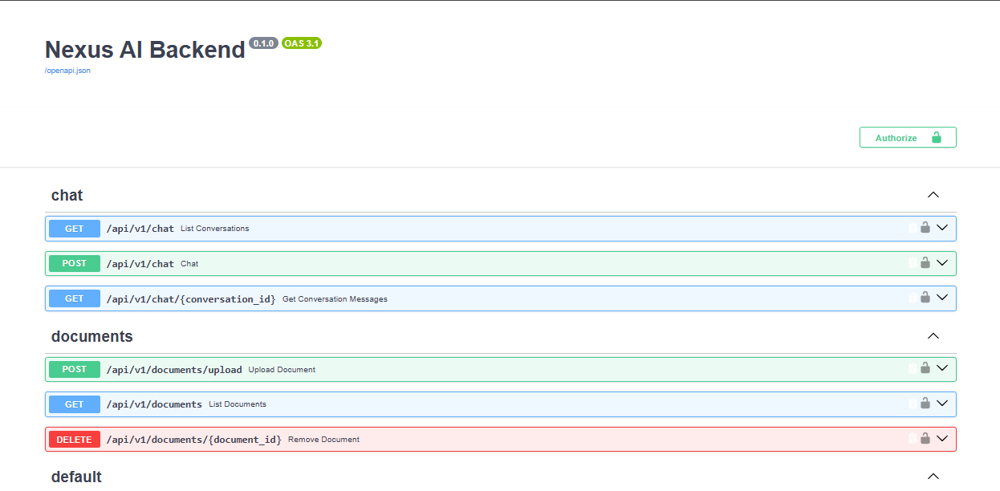

<div align="center">

# Nexus AI

### A modern, privacy-first Retrieval-Augmented Generation (RAG) platform

Chat with your own documents — powered by local LLMs, zero data leaves your infrastructure.

<p>
  
  
  
  
  
  
</p>

</div>

---

## 📖 Overview

**Nexus AI** lets users upload documents and interactively chat with them using Retrieval-Augmented Generation. It runs entirely on local LLMs via [Ollama](https://ollama.com/), so your data and queries never leave your infrastructure — combined with a fast, modern, and responsive UI.

## 📸 Screenshots

<div align="center">

**Landing Page**



<br /><br />

**Chat Interface**



<br /><br />

**Rag Response**



<br /><br />

**Swagger UI**



</div>

## 🌟 Features

| Feature | Description |
|---|---|
| 📄 **Document Ingestion** | Upload PDF, DOCX, CSV, TXT, and Markdown files |
| 💬 **Interactive Chat** | Real-time, cited conversations grounded in your documents |
| 🔒 **Local LLMs** | Powered by Ollama — data and queries never leave your infrastructure |
| 🔑 **Authentication** | Secure user auth via Supabase |
| 🎨 **Modern UI** | Built with Next.js, Tailwind CSS, and shadcn/ui |

## 🏗️ Architecture & Advanced Systems

Nexus AI goes beyond a simple LLM wrapper, incorporating enterprise-grade patterns for reliability, security, and performance.

### 🛡️ Security Pipeline — `SecurityPipeline`
Every input and output passes through a rigorous security check that guards against prompt injections, malicious inputs, and jailbreak attempts before reaching the LLM, and validates AI output before it reaches the user.

### ⚡ Response Caching — `ResponseCache`
An intelligent caching layer reduces load on local LLMs — identical questions against the same document context return an instant cached response instead of re-running retrieval and generation.

### 🧠 Production Agent System — `ProductionAgent`
A LangChain-based agent orchestration layer handles context building, prompt formatting, dynamic context injection, and LLM invocation — producing robust, well-cited answers instead of relying on a single raw API call.

## 🛠️ Tech Stack

<table>
<tr>
<td valign="top" width="50%">

**Frontend**
- [Next.js](https://nextjs.org/) (App Router)
- [React](https://react.dev/)
- [Tailwind CSS](https://tailwindcss.com/) & [shadcn/ui](https://ui.shadcn.com/)
- [@supabase/ssr](https://supabase.com/docs/guides/auth/server-side/nextjs)

</td>
<td valign="top" width="50%">

**Backend**
- [FastAPI](https://fastapi.tiangolo.com/)
- [LangChain](https://python.langchain.com/) & [LangChain-Ollama](https://python.langchain.com/docs/integrations/providers/ollama/)
- [Supabase](https://supabase.com/) (PostgreSQL & pgvector)
- [uv](https://github.com/astral-sh/uv) package manager

</td>
</tr>
</table>

Full interactive API documentation is available via **Swagger UI** at `http://localhost:8000/docs` once the backend is running.

## 📋 Prerequisites

- [Node.js](https://nodejs.org/) v18+
- [Python](https://www.python.org/) v3.10+
- [uv](https://github.com/astral-sh/uv) — Python package manager
- [Ollama](https://ollama.com/) — running locally
- A [Supabase](https://supabase.com/) project

## 🚀 Getting Started

### 1. Clone the repository

```bash
git clone <repository-url>
cd Rag-Project
```

### 2. Backend Setup

```bash
cd backend
uv sync
```

Create a `.env` file in the `backend` directory:

```env
SUPABASE_URL="your-supabase-url"
SUPABASE_KEY="your-supabase-service-role-key"
```

Start the FastAPI server:

```bash
uvicorn app.main:app --reload
```

The API will be available at `http://localhost:8000`.

### 3. Frontend Setup

```bash
cd ../frontend
npm install
```

Create a `.env.local` file in the `frontend` directory:

```env
NEXT_PUBLIC_SUPABASE_URL="your-supabase-url"
NEXT_PUBLIC_SUPABASE_ANON_KEY="your-supabase-anon-key"
NEXT_PUBLIC_API_URL="http://localhost:8000/api/v1"
```

Start the Next.js development server:

```bash
npm run dev
```

The frontend will be available at `http://localhost:3000`.

## 💡 Usage

1. Ensure Ollama is running and you've pulled a model (e.g. `ollama run llama3`).
2. Open `http://localhost:3000` in your browser.
3. Sign up or log in.
4. Upload your documents in the chat interface.
5. Ask questions and get cited answers directly from your data.

---

<div align="center">
<sub>Built with ❤️ using Next.js, FastAPI, and Ollama</sub>
</div>
